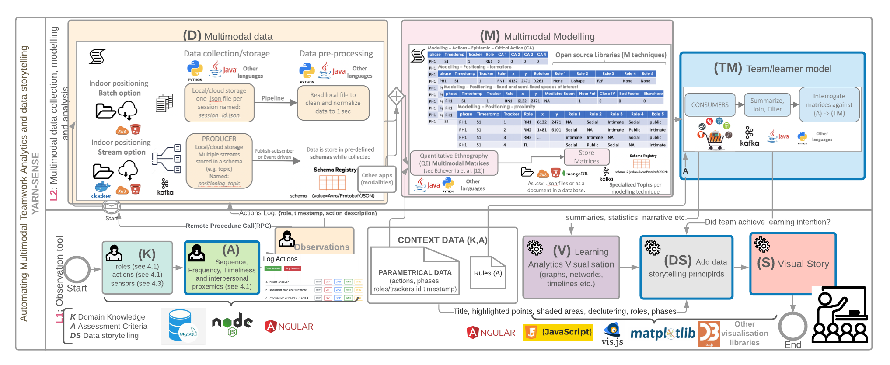

## Reference Implementation

The high level architecture described was implemented in a real scenario with 40 sessions, where data was collected from different teams.

The implementation diagrama describes how each componente of the architecture was used to automatically generate the MMLA Interfaces.

